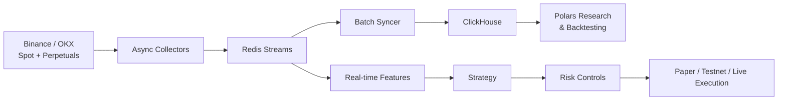

<div align="center">

# Ouroboros Quant Pipeline

**An event-driven crypto quant pipeline—from live market data to research, backtesting, and paper-first execution.**

Binance & OKX · Spot & Perpetuals · Redis Streams · ClickHouse · Polars · Docker Compose

</div>

> [!WARNING]
> Experimental software for research and engineering purposes.  
> Paper trading is enabled by default. This is not financial advice.

## Why Ouroboros?

Most quant repositories stop at notebooks or isolated backtests. Ouroboros connects the full workflow:

- Collect real-time order books, trades, mark prices, open interest, funding rates, and liquidations
- Route market events through Redis Streams
- Persist data to ClickHouse in Arrow-based batches
- Generate features and evaluate strategies with Polars
- Run paper-first execution with stale-data, spread, cost, position, and account-risk checks
- Switch to testnet or live execution only through explicit configuration

## Architecture



## Current Capabilities

| Area | What is implemented |
|---|---|
| Market data | Binance and OKX spot/perpetual collectors |
| Streaming | Redis Streams with consumer groups |
| Storage | Batched ClickHouse ingestion using Polars and Arrow |
| Research | Feature generation, labeling, threshold search, and backtesting |
| Modeling | Time-based training split with purge window and evaluation metrics |
| Execution | Paper-first execution and explicit live-trading switches |
| Risk | Data freshness, spread, estimated cost, exposure, and account protection |

## Quick Start

```bash
git clone https://github.com/martinyip86/MLOps-quant-pipeline.git
cd MLOps-quant-pipeline

cp .env.example .env
docker compose up -d quant-redis clickhouse collector-binance syncer

docker compose ps
curl -fsS http://localhost:8080/health
```

## Project Status

Ouroboros is under active development. The current stable path is the original
executor under `src/executor/`; `src/executor_v2/` should be considered experimental.

See the roadmap for upcoming work on testing, reproducible deployment,
experiment tracking, and strategy configuration.
